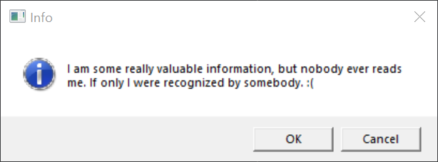
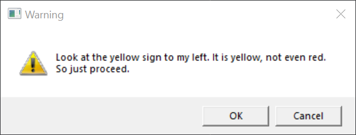
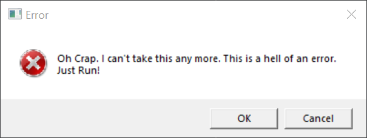
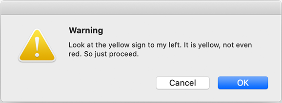
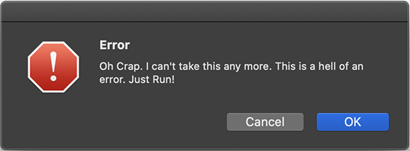
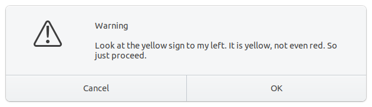
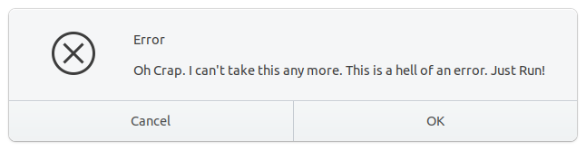

# Native Message Box
NMB or (N)ative (M)essage (B)ox is a very tiny, cross platform and header only C++ library to natively handle message dialogs.

## Supported
- Window (using [Winuser.h](https://docs.microsoft.com/en-us/windows/win32/api/winuser/))
- MacOS (using [CoreFoundation](https://developer.apple.com/documentation/corefoundation))
- Linux (using [GTK](https://www.gtk.org/docs/installations/linux/))

## Example Usage

```cpp
#include "NMB/NMB.h"

...

NMB::Result result = NMB::open( "Error", "Error Message", NMB::Icon::ERROR );

if( result == NMB::Result::OK )
{
    // DO SOMETHING
}
else
{
    // DO SOMETHING ELSE
}
``` 

## Screenshots
### Windows







### MacOS






### Linux 






## License

LICENSE File covers all files in this repo.